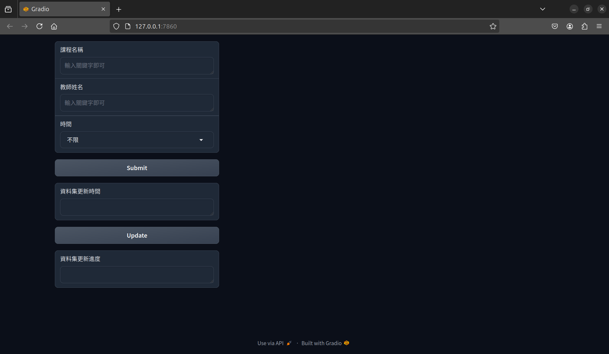

# NTU Classroom Schedule Crawler

This program retrieves the latest semester's course information from the [NTU classroom schedule website](https://gra206.aca.ntu.edu.tw/classrm/index.php/acarm/webcr-use-new). Users can search for courses by entering course keywords or instructor names, and click on the listed course names to view past course syllabus records. When the dataset needs updating, users can click the update button to refresh the dataset, which takes about seven minutes.

[Here](https://huggingface.co/spaces/HaileyIsNotAPig/NTU-Class) is a simplified version of the Gradio web interface, which can be used directly without downloading.

此程式會抓取[台大教室課表](https://gra206.aca.ntu.edu.tw/classrm/index.php/acarm/webcr-use-new)中最新學期的課程資訊。使用者可以藉由輸入課程關鍵字或教師名字來搜尋課程，並且點擊列出的課程名稱以了解過往課程大綱紀錄。當資料集需要更新時，使用者可以點擊更新按鈕進行資料集更新，過程約需七分鐘。

[此處](https://huggingface.co/spaces/HaileyIsNotAPig/NTU-Class)為簡化版的Gradio網頁介面，無需下載即可直接使用。

## Prerequisites
- Python 3.10

## Installation

You can use pip to load the required packages from the `requirements.txt` file.

```bash
pip install -r pip_requirements.txt
```

## Usage

1. Run the script python `app.py`.
2. Hold down Ctrl and click on the local URL.
3. You will see the following screen. 

